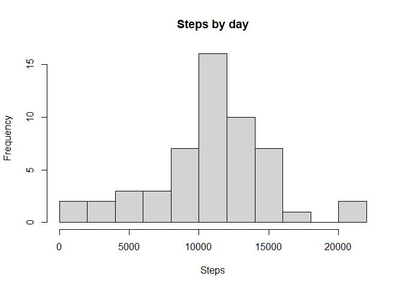
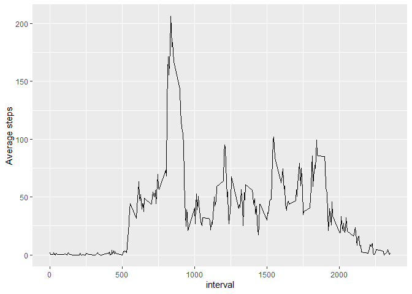
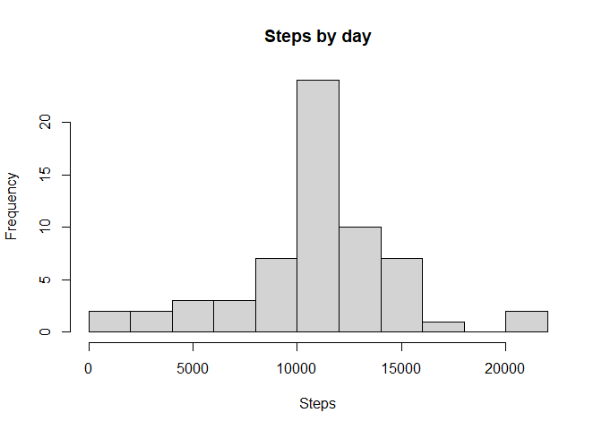
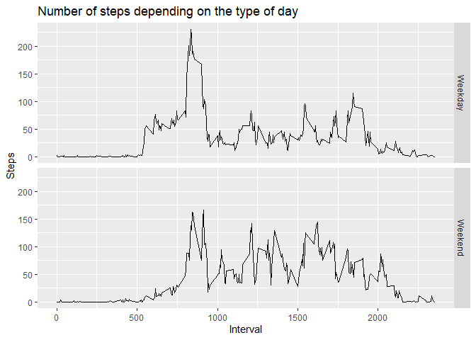

---
title: "Reproducible Research: Peer Assessment 1"
output: 
  html_document:
    keep_md: true
---


## Loading and preprocessing the data


```r
library(dplyr)
```

```
## 
## Attaching package: 'dplyr'
```

```
## The following objects are masked from 'package:stats':
## 
##     filter, lag
```

```
## The following objects are masked from 'package:base':
## 
##     intersect, setdiff, setequal, union
```

```r
library(ggplot2)

setwd("D:\\Archivos\\R\\RepData_PeerAssessment1")
if(!file.exists("activity.csv"))
{
    unzip("activity.zip")
}

data <- read.csv("activity.csv", header = TRUE)
head(data)
```

```
##   steps       date interval
## 1    NA 2012-10-01        0
## 2    NA 2012-10-01        5
## 3    NA 2012-10-01       10
## 4    NA 2012-10-01       15
## 5    NA 2012-10-01       20
## 6    NA 2012-10-01       25
```


## What is mean total number of steps taken per day?

### 1. Calculate total number of steps taken each day


```r
data_day <- data %>% select(date, steps) %>% na.omit() %>% group_by(date) %>% summarize(total_steps= sum(steps))
```

```
## `summarise()` ungrouping output (override with `.groups` argument)
```

```r
hist(data_day$total_steps, xlab = "Steps", ylab = "Frequency", main = "Steps by day", breaks = 10)
```

<!-- -->

### 3. Calculate and report the mean and median of the total number of steps taken per day


```r
mean(data_day$total_steps)
```

```
## [1] 10766.19
```

```r
median(data_day$total_steps)
```

```
## [1] 10765
```

## What is the average daily activity pattern?

### 1. Make a time series plot of the 5-minute interval (x-axis) and the average number of steps taken, averaged across all days (y-axis)


```r
data_interval <- data %>% select(interval, steps) %>% na.omit() %>% group_by(interval) %>% summarize(mean_steps = mean(steps)) 
```

```
## `summarise()` ungrouping output (override with `.groups` argument)
```

```r
ggplot(data_interval, aes(x = interval, y = mean_steps)) + geom_line() + ylab("Average steps")
```

<!-- -->


### 2. Which 5-minute interval, on average across all the days in the dataset, contains the maximum number of steps?


```r
data_interval[data_interval$mean_steps == max(data_interval$mean_steps), ]
```

```
## # A tibble: 1 x 2
##   interval mean_steps
##      <int>      <dbl>
## 1      835       206.
```


## Imputing missing values

### 1. Calculate and report the total number of missing values in the dataset


```r
sum(is.na(data))
```

```
## [1] 2304
```

### 2. Devise a strategy for filling in all of the missing values in the dataset. The strategy does not need to be sophisticated. For example, you could use the mean/median for that day, or the mean for that 5-minute interval, etc.

I used the mean of the corresponding intervals.


```r
fill_missing <- function(x) 
{
  replace(x, is.na(x), mean(x, na.rm = TRUE))
}
filled_data <- data %>% group_by(interval) %>% mutate(steps = fill_missing(steps))
```

### 4. Make a histogram of the total number of steps taken each day and Calculate and report the mean and median total number of steps taken per day. Do these values differ from the estimates from the first part of the assignment? What is the impact of imputing missing data on the estimates of the total daily number of steps?


```r
steps_filled_sum <- filled_data %>% select(date, steps) %>% group_by(date) %>% summarize(total_steps = sum(steps))
```

```
## Adding missing grouping variables: `interval`
```

```
## `summarise()` ungrouping output (override with `.groups` argument)
```

```r
hist(steps_filled_sum$total_steps, xlab = "Steps", ylab = "Frequency", main = "Steps by day", breaks = 10)
```

<!-- -->

Mean:


```r
first_mean <- mean(data_day$total_steps)
second_mean <- mean(steps_filled_sum$total_steps)
first_mean
```

```
## [1] 10766.19
```

```r
second_mean
```

```
## [1] 10766.19
```


Median:


```r
first_median <- median(data_day$total_steps)
second_median <- median(steps_filled_sum$total_steps)
first_median
```

```
## [1] 10765
```

```r
second_median
```

```
## [1] 10766.19
```

The results are almost identical. The impact of imputting data is minimal.

## Are there differences in activity patterns between weekdays and weekends?


```r
filled_data$date <- as.Date(filled_data$date)
filled_data$day <- weekdays(filled_data$date)
filled_data$day <- ifelse(filled_data$day=="sábado" | filled_data$day=="domingo", "Weekend", "Weekday" )
mean_by_day <- filled_data %>% group_by(day, interval) %>% summarize(mean_steps_day_type = mean(steps))
```

```
## `summarise()` regrouping output by 'day' (override with `.groups` argument)
```

```r
g <- ggplot(mean_by_day, aes(x=interval, y=mean_steps_day_type)) 

g <- g + geom_line() + facet_grid(day ~.) 

g <- g + xlab("Interval") + ylab("Steps") + ggtitle("Number of steps depending on the type of day")

g
```

<!-- -->

The activity patterns seem to be different.
